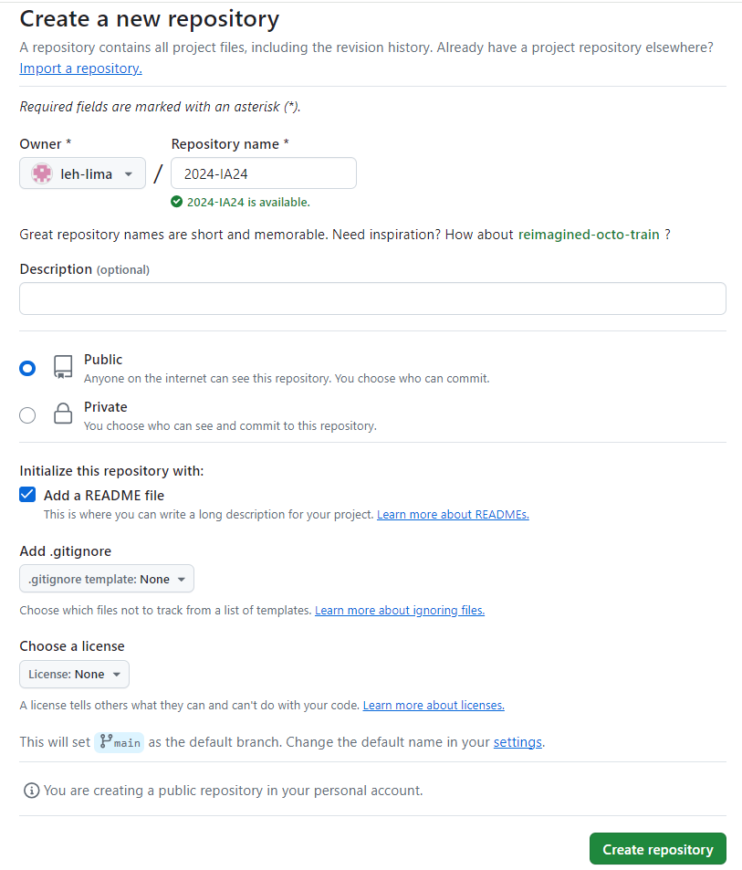
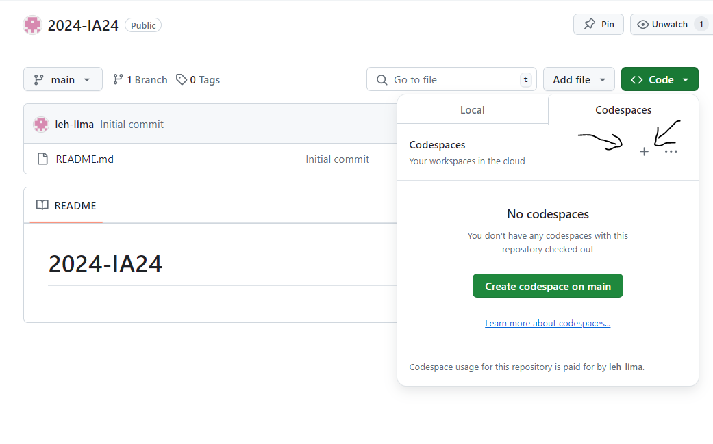
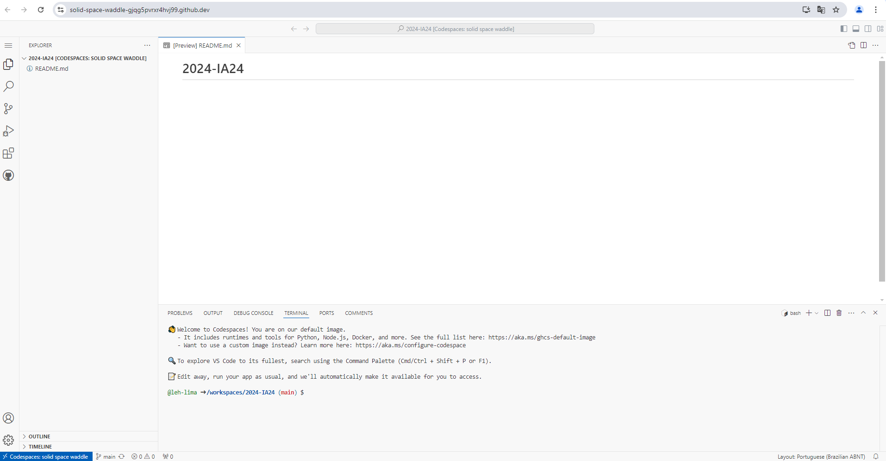
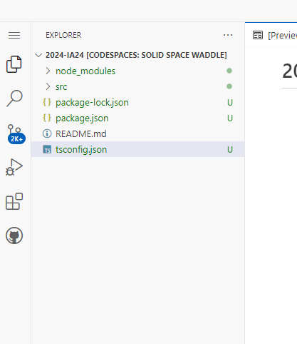

# Atividade de programação IA22-IA24

# Criando um Repositório no CodeSpace

Crie um Repositório chamado "2024-IA24".

para isso, clique no botão verde escrito "new":

O Repositório deve ser publico e deve adicionar arquivo README, certifique que ele ficará igual como está a imagem!!



Depois de conferir e estar tudo certo, pode clicar no botão verde escrito "Create repository"

Após criar o repositorio, vai aparecer essa tela, você clica no botão verde escrito "code", dentro de "code" você clica em Codespaces e depos no sinal "+"



após isso, irá aparecer essa tela:



#Iniciando o Node.js com TypeScript

Clique no terminal no canto inferior da tela:

Digite o seguinde codigo no terminal:

SE FOR COPIAR, COPIA UMA LINHA POR VEZ SE NÃO VAI DAR ERRO


1° linha
```
npm init -y
````
2° linha
```
npm install express cors sqlite3 sqlite
````
3° linha
```
npm install --save-dev typescript nodemon ts-node @types/express @types/cors
````
4° linha
```
npx tsc --init
````
5° linha
```
mkdir src
````
6° linha
```
touch src/app.ts
````

Após colocar esse código, o canto esquerdo da sua tela ficará assim:




#Configurando o tsconfig.json

Para mudar a linha >>"outDir": "./" <<, para >>"outDir": "./dist" <<, aperte Control + F e pesquise outDir (facilita para achar a linha).


e adicione embaixo a linha  "rootDir": "./src", seu arquivo de configuração do compilador do TypeScript ficará mais ou menos assim.

Dica: Para encontrar rapidamente: Control + F e coloque outDir.

Lembrando: Cuidado com as "" para nao ter nenhum erro.


aperte Control + F e coloque outDir.