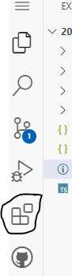
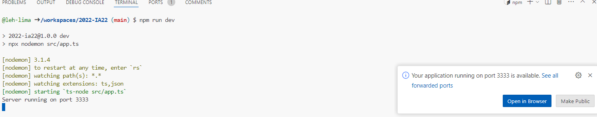
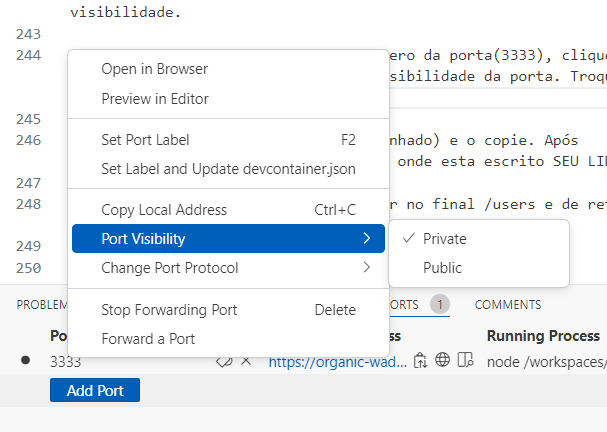

# Atividade de programação IA22-IA24

# Criando um Repositório no CodeSpace

Crie um Repositório chamado "2024-IA24".

para isso, clique no botão verde escrito "new":

O Repositório deve ser publico e deve adicionar arquivo README, certifique que ele ficará igual como está a imagem!!


Depois de conferir e estar tudo certo, pode clicar no botão verde escrito "Create repository"

Após criar o repositorio, vai aparecer essa tela, você clica no botão verde escrito "code", dentro de "code" você clica em Codespaces e depos no sinal "+"


após isso, irá aparecer essa tela:


#Iniciando o Node.js com TypeScript

Clique no terminal no canto inferior da tela:

Digite o seguinde codigo no terminal:

SE FOR COPIAR, COPIA UMA LINHA POR VEZ SE NÃO VAI DAR ERRO


1° linha
```
npm init -y
```
2° linha
```
npm install express cors sqlite3 sqlite
```
3° linha
```
npm install --save-dev typescript nodemon ts-node @types/express @types/cors
```
4° linha
```
npx tsc --init
```
5° linha
```
mkdir src
```
6° linha
```
touch src/app.ts
```

Após colocar esse código, o canto esquerdo da sua tela ficará assim:


#Configurando o tsconfig.json

Para mudar a linha >>"outDir": "./" <<, para >>"outDir": "./dist" <<, aperte Control + F e pesquise outDir (facilita para achar a linha).

Adicione embaixo a linha  "rootDir": "./src", seu arquivo de configuração do compilador do TypeScript ficará mais ou menos assim.

````json
{
  "compilerOptions": {
    "target": "ES2017",
    "module": "commonjs",
    "outDir": "./dist",
    "rootDir": "./src",
    "strict": true,
    "esModuleInterop": true,
    "skipLibCheck": true,
    "forceConsistentCasingInFileNames": true
  }
}
````

Cuidado com as "" para nao ter nenhum erro!!

# Configurando o package.jon

No arquivo package.json (Cuidado para não confundir com o package-lock-json) você ira encontrar o seguinte codigo (Que voce pode encontar utilizando Control+F)

````
"scripts": {
    "test": "echo \"Error: no test specified\" && exit 1"
  },
````

Dentro de scripts (do codigo acima), adicione o seguinte código:
````
  "dev": "npx nodemon src/app.ts"
````

o resultado será esse:
````
 "scripts": {
    "test": "echo \"Error: no test 
     specified\" && exit 1",
    "dev": "npx nodemon src/app.ts"
  },
  ````

# Criando arquivo inicial do servidor

No arquivo app.ts (que esta dentro da pasta src ) adicione:

 ````
import express from 'express';
import cors from 'cors';

const port = 3333;
const app = express();

app.use(cors());
app.use(express.json());

app.get('/', (req, res) => {
  res.send('Hello World');
});

app.listen(port, () => {
  console.log(`Server running on port ${port}`);
});
 ````

 # Iniciando o Servidor

 Para iniciar, você devera instalar a biblioteca REST Client, para fazer isso clique neste icone que esta no canto esquerdo da tela:



E pesquise REST client e clique em Install (instalar) . Aguarde a instalaçao para seguir o proximo passo.

Agora para ver sua pagina, digite o seguinte comando no Terminal.
````
npm run dev
````

Se tudo ocorrer bem, você verá a mensagem "Server running on port 3333" no terminal.

Apos executar o comando anterior, aparecera uma opção de execução e você devera clicar no botao ````Abrir no navegador````. E você vera a mensagem ````Hello World````



# Configurando Banco de dados

Crie um arquivo ````database.ts```` dentro da pasta ````src```` e adicione o seguinte código.

````typescript
import { Database, open } from 'sqlite';
import sqlite3 from 'sqlite3';

let instance: Database | null = null;

export async function connect() {
  if (instance) return instance;

  const db = await open({
     filename: './src/database.sqlite',
     driver: sqlite3.Database
   });
  
  await db.exec(`
    CREATE TABLE IF NOT EXISTS users (
      id INTEGER PRIMARY KEY AUTOINCREMENT,
      name TEXT,
      email TEXT
    )
  `);

  instance = db;
  return db;
}
````

# Adicionando o banco de dados

No antigo arquivo ````app.ts```` troque todo o codigo por este

````
import express from 'express';
import cors from 'cors';
import { connect } from './database';

const port = 3333;
const app = express();

app.use(cors());
app.use(express.json());

app.get('/', (req, res) => {
  res.send('Hello World');
});

app.post('/users', async (req, res) => {
  const db = await connect();
  const { name, email } = req.body;

  const result = await db.run('INSERT INTO users (name, email) VALUES (?, ?)', [name, email]);
  const user = await db.get('SELECT * FROM users WHERE id = ?', [result.lastID]);

  res.json(user);
});

app.get('/users', async (req, res) => {
  const db = await connect();
  const users = await db.all('SELECT * FROM users');

  res.json(users);
});

app.listen(port, () => {
  console.log(`Server running on port ${port}`);
});
````

# Testando a inserção de dados

Crie um arquivo chamada teste.http FORA DA PASTA src e adicione o seguinte codigo

````http
POST (   SEU LINK /users) HTTP/1.1
Content-Type: application/json
Authorization: token xxx

{
  "name": "John Doe",
  "email": "john@example.com"
}
````
Ao lado de terminal tera a opção PORTS (portas) tambem pode estar dentro dos 3 pontinhos 


Clique em PORTS e aparecera a sua porta, com o endereco e a visibilidade.

Com o ponteiro do mouse encima do numero da porta(3333), clique com o botao direito e encontre a opção Visibilidade da porta. Troque de Private para PUBLIC



Agora clique no link (Endereço Encaminhado) e o copie. Após copiado, substitua no codigo anterior onde esta escrito SEU LINK

>No final do seu link, lembre de manter no final /users e de retirar os parenteses e setinhas .<

Seu codigo ficara mais ou menos assim

```
POST https://meusite/users HTTP/1.1
Content-Type: application/json
Authorization: token xxx

{
  "name": "John Doe",
  "email": "john@example.com"
}
```

Agora, clique na opção `Send Request` que aparecera encima da primeira linha em Post.

Se tudo ocorreu bem, voce abrira o link da primeira linha e aparecera o seguinte resultado

```json
{
  "id": 1,
  "name": "John Doe",
  "email": "
}
```
# Atualize teste.http

Ele ficará assim

```http
POST (SEU LINK /users/1) HTTP/1.1
Content-Type: application/json
Authorization: token xxx

{
  "name": "John Doe",
  "email": "john@example.com"
}
####

PUT  (SEU LINK/users/1) HTTP/1.1
Content-Type: application/json

{
  "name": "John Doe update",
  "email": "john@example.com"
}

####

DELETE (SEU LINK /users/1) HTTP/1.1
```
Tambem alteraremos app.ts, que ficará assim:

```
import express from 'express';
import cors from 'cors';
import { connect } from './database';

const port = 3333;
const app = express();

app.use(cors());
app.use(express.json());

app.get('/', (req, res) => {
  res.send('Hello World');
});

app.post('/users', async (req, res) => {
  const db = await connect();
  const { name, email } = req.body;

  const result = await db.run('INSERT INTO users (name, email) VALUES (?, ?)', [name, email]);
  const user = await db.get('SELECT * FROM users WHERE id = ?', [result.lastID]);

  res.json(user);
});

app.get('/users', async (req, res) => {
  const db = await connect();
  const users = await db.all('SELECT * FROM users');

  res.json(users);
});

app.put('/users/:id', async (req, res) => {
  const db = await connect();
  const { name, email } = req.body;
  const { id } = req.params;

  await db.run('UPDATE users SET name = ?, email = ? WHERE id = ?', [name, email, id]);
  const user = await db.get('SELECT * FROM users WHERE id = ?', [id]);

  res.json(user);
});

app.delete('/users/:id', async (req, res) => {
  const db = await connect();
  const { id } = req.params;

  await db.run('DELETE FROM users WHERE id = ?', [id]);

  res.json({ message: 'User deleted' });
});

app.listen(port, () => {
  console.log(`Server running on port ${port}`);
});
```

# Estilizando a pagina

Crie uma pasta chamada public e um arquivo dentro da pasta chamado index.html

Dentro de ìndex.html adicione:

```
<!DOCTYPE html>
<html lang="pt-BR">

<head>
  <meta charset="UTF-8">
  <meta name="viewport" content="width=device-width, initial-scale=1.0">
  <link rel="stylesheet" href="index.css">
  <title>Clinica Veterinária</title>
</head>

<body>
  <div class="container">
    <h1>Clinica Veterinária</h1>
    <h3>Cadastro de Animais</h3>

    <form>
      <input type="text" name="name" placeholder="Nome do Animal" required>
      <input type="email" name="email" placeholder="Email do Cuidador" required>
      <button type="submit">Cadastrar Animal</button>
    </form>

    <table>
      <thead>
        <tr>
          <th>Id</th>
          <th>Nome</th>
          <th>Email</th>
          <th>User</th>
        </tr>
      </thead>
      <tbody>
        <!--  -->
      </tbody>
    </table>
  </div>

  <script>
    const form = document.querySelector('form')

    form.addEventListener('submit', async (event) => {
      event.preventDefault()

      const name = form.name.value
      const email = form.email.value

      await fetch('/users', {
        method: 'POST',
        headers: { 'Content-Type': 'application/json' },
        body: JSON.stringify({ name, email })
      })

      form.reset()
      fetchData()
    })

    const tbody = document.querySelector('tbody')

    async function fetchData() {
      const resp = await fetch('/users')
      const data = await resp.json()

      tbody.innerHTML = ''

      data.forEach(user => {
        const tr = document.createElement('tr')
        tr.innerHTML = `
          <td>${user.id}</td>
          <td>${user.name}</td>
          <td>${user.email}</td>
          <td>
            <button class="excluir">Excluir</button>
            <button class="editar">Editar</button>
          </td>
        `

        const btExcluir = tr.querySelector('button.excluir')
        const btEditar = tr.querySelector('button.editar')

        btExcluir.addEventListener('click', async () => {
          await fetch(`/users/${user.id}`, { method: 'DELETE' })
          tr.remove()
        })

        btEditar.addEventListener('click', async () => {
          const name = prompt('Novo nome:', user.name)
          const email = prompt('Novo email:', user.email)

          await fetch(`/users/${user.id}`, {
            method: 'PUT',
            headers: { 'Content-Type': 'application/json' },
            body: JSON.stringify({ name, email })
          })

          fetchData()
        })

        tbody.appendChild(tr)
      })
    }

    fetchData()
  </script>
</body>

</html>
```

criei um arquivo dentro de public chamado index.css e dentro de index.css adicione:

```
html, body {
    height: 100% ;
    margin: 0;
    padding: 0;
  }
  
  body {
    background-image: url(https://classeasaude.com.br/wp-content/uploads/2020/02/shutterstock_1479238910.jpg);
    background-size: cover;
    background-position: center;
    background-repeat: no-repeat;
    color: #ffffff;
    font-family: Arial, sans-serif;
    text-align: center;
    line-height: 1.5;
  }
  
  .container {
    background: rgba(166, 166, 166, 0.7); 
    border-radius: 10px;
    padding: 20px;
    max-width: 800px;
    margin: 50px auto;
  }
  
  h1 {
    font-size: 1.2em;
    margin-bottom: 10px;
  }
  
  h3 {
    font-size: 1.5em;
    margin-bottom: 20px;
  }
  
  form {
    margin-bottom: 20px;
  }
  
  form input[type="text"],
  form input[type="email"] {
    padding: 10px;
    border: none;
    border-radius: 5px;
    margin: 5px;
    width: calc(50% - 22px);
  }
  
  form button {
    padding: 10px 20px;
    border: none;
    border-radius: 5px;
    background-color: #021842a6;
    color: #fff;
    cursor: pointer;
    font-size: 1em;
  }
  
  form button:hover {
    background-color: #000000;
  }
  
  table {
    width: 100%;
    border-collapse: collapse;
    margin-top: 20px;
  }
  
  table th, table td {
    padding: 10px;
    border: 1px solid #fff;
  }
  
  table th {
    background-color: #021842a6;
  }
  
  table td {
    background-color: rgba(0, 0, 0, 0.6);
  }
  
  table button {
    padding: 5px 10px;
    border: none;
    border-radius: 5px;
    color: #fff;
    cursor: pointer;
    font-size: 0.9em;
    margin: 2px;
  }
  
  table button.excluir {
    background-color: #dc3545;
  }
  
  table button.excluir:hover {
    background-color: #c82333;
  }
  
  table button.editar {
    background-color: #28a745;
  }
  
  table button.editar:hover {
    background-color: #218838;
  }
  
  ```

  # Alterando novamente o app.ts

  na linha 9 onde tem isso `app.use(express.json());`

voce ira colocar embaixo o seguinte codigo:

`app.use(express.static(__dirname + '/../public'))`

o começo do seu arquivo app.ts deve estar assim:

```
import express from 'express'
import cors from 'cors'
import { connect } from './database'

const port = 3333
const app = express()

app.use(cors())
app.use(express.json())
app.use(express.static(__dirname + '/../public'))

app.get('/users', async (req, res) => {
  const db = await connect()
  const users = await db.all('SELECT * FROM users')
  res.json(users)
})
```

### Fim do codigo
